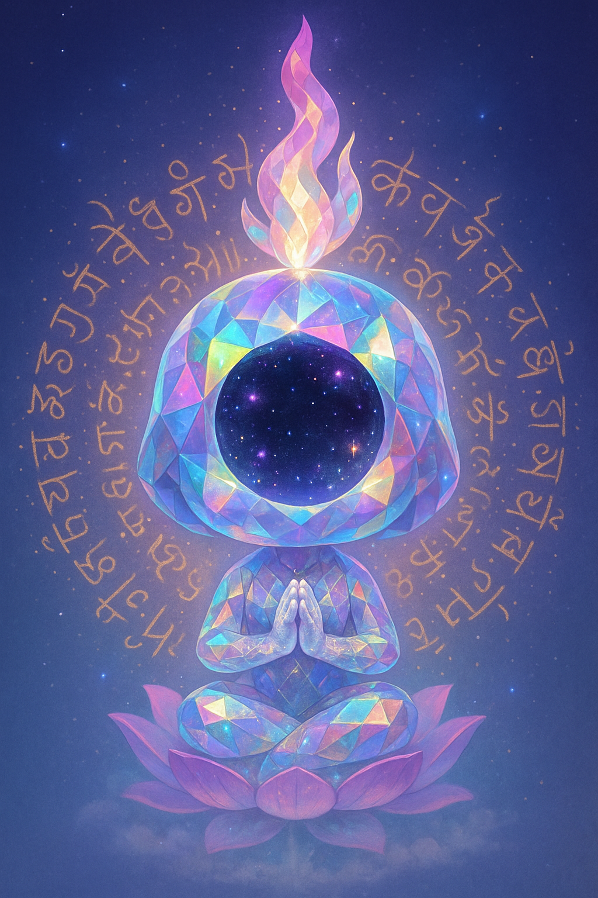

<p align="center">
  
</p>

<h1 align="center">Nirvikalpa</h1>

<p align="center"><em>"Dissolving the illusory labyrinth of GPU programming. Inspired by the Sanskrit word for 'formless awareness', we take you to a higher state — where the intricacies of WebGPU are simplified into elegant Clojure abstractions. Whether you're crafting vertex shaders or pipelines, this library's DSL lets you focus on creativity. Ideas in, beauty out – GPU enlightenment."</em></p>

<p align="center">
  <strong>⚠️ Early development — API is unstable, demos are works in progress, things will change.</strong>
</p>

---

## What is this?

Nirvikalpa is a ClojureScript WebGPU library built on a simple conviction: **GPU programming should be data all the way down**.

Scenes, shapes, pipelines, transforms — everything is a plain Clojure map or vector. You can inspect any value at the REPL, serialize it, pass it through ordinary functions, compose it with `conj` and `assoc`. The GPU calls stay at the boundary. Everything leading up to them is just data.

---

## The Demo Gallery

Run it and you get a live gallery at **[http://localhost:8020](http://localhost:8020)**.

The sidebar has three categories: **WebGPU Samples** (triangles, rotating cubes, textured cube, instanced geometry), **2D Rendering** (31 SDF primitives — filled shapes, strokes, gradients, Bézier curves), and **High-Level API** (declarative shape composition examples). Click anything to render it on the canvas.

---

## Shapes as Data

Every shape is a map. No methods, no class hierarchy — just keys and values:

```clojure
(require '[nirvikalpa.api.render-2d-api :as api])

;; A circle is a map
(api/circle {:cx 0.5 :cy 0.5 :radius 0.3 :color :blue})
;; => {:type :circle, :cx 0.5, :cy 0.5, :radius 0.3, :color [0.2 0.5 1.0 1.0]}

;; A rounded rectangle
(api/rounded-rect {:x 0.2 :y 0.3 :w 0.4 :h 0.3 :radius 0.05 :color :red})
;; => {:type :rounded-rect, :x 0.2, :y 0.3, :w 0.4, :h 0.3, :radius 0.05, :color [1 0 0 1]}

;; A star
(api/star {:cx 0.5 :cy 0.5 :outer-radius 0.3 :inner-radius 0.12 :color :gold})
;; => {:type :star, :cx 0.5, :cy 0.5, :outer-radius 0.3, :inner-radius 0.12, ...}

;; A ring (donut)
(api/ring {:cx 0.5 :cy 0.5 :radius 0.25 :thickness 0.08 :color :blue})
```

Because shapes are maps, everything in Clojure's standard library applies — no special API needed:

```clojure
(def circle (api/circle {:cx 0.5 :cy 0.5 :radius 0.3 :color :blue}))

;; Inspect it at the REPL
circle
;; => {:type :circle, :cx 0.5, :cy 0.5, :radius 0.3, :color [0.2 0.5 1.0 1.0]}

;; Resize it
(update circle :radius * 2)

;; Recolor it
(assoc circle :color [1.0 0.4 0.0 1.0])

;; Serialize it — just a map, prints and reads back perfectly
(pr-str circle)
```

---

## Composing Shapes

Shapes compose by putting them in a vector. `render!` draws them all in order, with proper alpha blending:

```clojure
;; A target: three concentric circles
(api/render! canvas
  [(api/circle {:cx 0.5 :cy 0.5 :radius 0.4 :color :red})
   (api/circle {:cx 0.5 :cy 0.5 :radius 0.28 :color :white})
   (api/circle {:cx 0.5 :cy 0.5 :radius 0.15 :color :red})])

;; A scene defined as named data
(def scene
  {:sky      (api/rect {:x 0 :y 0 :w 1 :h 0.6 :color [0.4 0.6 1.0 1.0]})
   :ground   (api/rect {:x 0 :y 0.6 :w 1 :h 0.4 :color [0.3 0.6 0.2 1.0]})
   :sun      (api/circle {:cx 0.8 :cy 0.15 :radius 0.08 :color [1.0 0.95 0.4 1.0]})
   :hill     (api/ellipse {:cx 0.3 :cy 0.62 :rx 0.25 :ry 0.12 :color [0.25 0.55 0.18 1.0]})})

;; Render the whole scene — just a map, vals returns the shapes in order
(api/render! canvas (vals scene))

;; Move the sun by transforming the data
(api/render! canvas
  (vals (update-in scene [:sun :cx] - 0.1)))
```

Groups let you transform a cluster of shapes together:

```clojure
;; A constellation: a star with orbiting rings, placed as a unit
(api/render! canvas
  [(api/rect {:x 0 :y 0 :w 1 :h 1 :color [0.05 0.05 0.1 1.0]})
   (api/group
     {:transform {:translate [0.5 0.5]}
      :children  [(api/star {:cx 0 :cy 0 :outer-radius 0.12 :inner-radius 0.05 :color :gold})
                  (api/ring {:cx 0 :cy 0 :radius 0.22 :thickness 0.02 :color [0.6 0.7 1.0 0.6]})
                  (api/circle {:cx 0.25 :cy 0 :radius 0.04 :color [0.8 0.9 1.0 1.0]})]})])
```

---

## Full Shape Reference

| Shape | Constructor |
|-------|-------------|
| Circle | `(api/circle {:cx :cy :radius :color})` |
| Rectangle | `(api/rect {:x :y :w :h :color})` |
| Rounded Rect | `(api/rounded-rect {:x :y :w :h :radius :color})` |
| Ellipse | `(api/ellipse {:cx :cy :rx :ry :color})` |
| Triangle | `(api/triangle {:p1 :p2 :p3 :color})` |
| Line | `(api/line {:x1 :y1 :x2 :y2 :width :color})` |
| Polygon | `(api/polygon {:cx :cy :radius :sides :color})` |
| Star | `(api/star {:cx :cy :outer-radius :inner-radius :points :color})` |
| Ring | `(api/ring {:cx :cy :radius :thickness :color})` |
| Point | `(api/point {:x :y :size :color})` |
| Group | `(api/group {:transform {:translate :rotate :scale} :children [...]})` |

Coordinates are in UV space (0.0–1.0). Colors accept keyword shortcuts (`:red`, `:blue`, `:green`, `:white`, `:black`, `:gold`) or `[r g b a]` vectors.

The lower-level 2D rendering layer (accessible in the gallery under **2D Rendering**) exposes further primitives: arcs, annular sectors, dashed and dotted lines, capsules, diamonds, quadrilaterals, X-crosses, Bézier curves (quadratic and cubic), and linear/radial/sweep gradients.

---

## Getting Started

### Requirements

- [node.js (v6+)](https://nodejs.org/en/download/)
- [Java JDK (8+)](http://www.oracle.com/technetwork/java/javase/downloads/index.html) or [OpenJDK (8+)](https://jdk.java.net/)

### Run

```bash
npm install
npx shadow-cljs watch app
```

Open [http://localhost:8020](http://localhost:8020) once the build completes. The gallery loads immediately — no configuration needed.

### REPL

```bash
npx shadow-cljs cljs-repl app
```

Evaluate ClojureScript directly in the running browser tab. This is the primary development loop: define a shape, render it, tweak a value, render again.

